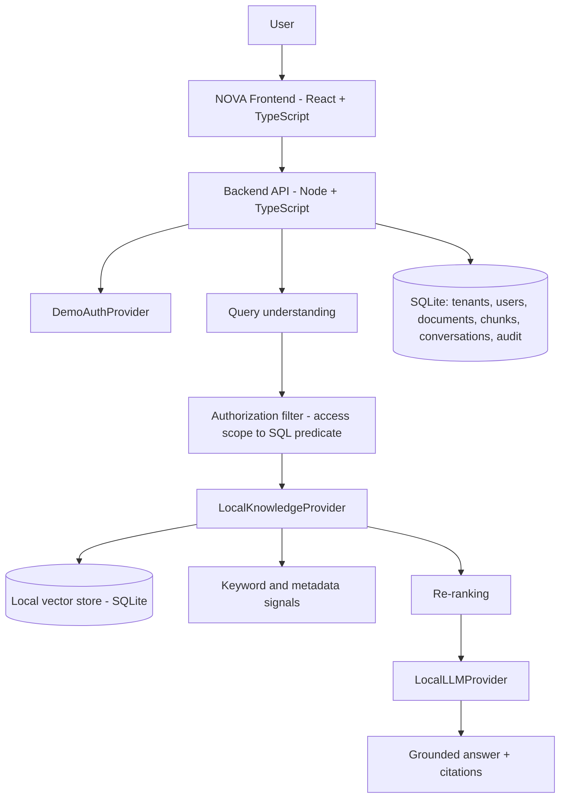
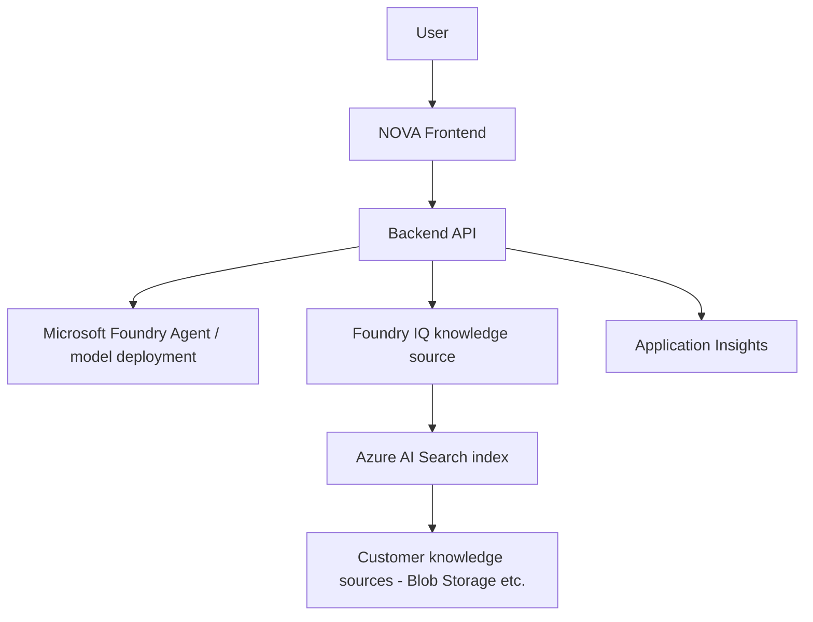
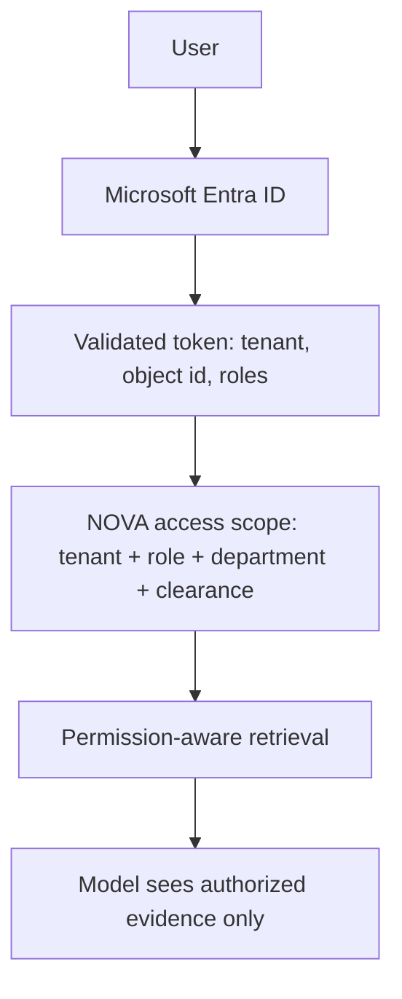

# Architecture

NOVA is a multi-tenant RAG platform. Every capability that could ever be served by a cloud
service sits behind an interface, so switching providers is configuration, not code.

## Seams

| Interface | Local implementation | Azure implementation (disabled) |
| --- | --- | --- |
| `LLMProvider` | `llm/local.ts` (OpenAI-compatible endpoint, or deterministic extractive fallback) | `llm/azure_foundry.ts` |
| `KnowledgeProvider` | `knowledge/local.ts` (hybrid vector + keyword + metadata) | `knowledge/azure_foundry_iq.ts` |
| `VectorStore` | `retrieval/vector/local.ts` (SQLite) | `retrieval/vector/azure.ts` (Azure AI Search) |
| `EmbeddingProvider` | `embeddings/local.ts` | `embeddings/azure.ts` |
| `AuthProvider` | `auth/demo.ts` (persona selector) | `auth/entra.ts` |
| `ActionProvider` | `actions/local.ts` (simulated incidents) | `actions/azure.ts` (workflow endpoint) |
| `ActionExecutor` (Phase 8) | `actions/governed/executors.ts` `LocalMockExecutor` | `AzureFunctionExecutor` -> `azure-functions/nova-actions` |

Providers are chosen once in the factories (`llm/index.ts`, `knowledge/index.ts`, `auth/index.ts`,
`actions/index.ts`) from `config/index.ts`. No other module knows which implementation is live.

## Local runtime



## Azure runtime (prepared, off by default)



## Identity



## Request lifecycle

1. `POST /api/chat` resolves the bearer token to a principal via `AuthProvider`.
2. `buildAccessScope` turns role grants into a scope object (tenant, role, department, clearance,
   explicit grants).
3. `understandQuery` normalises the question, expands terms and hints departments/categories, and
   detects action intent (e.g. incident reporting).
4. `accessSqlFilter(scope)` becomes a SQL predicate applied *inside* the vector store, so
   unauthorized rows never leave the data layer.
5. Hybrid scoring (vector 0.6 / keyword 0.4 by default) plus metadata boosts, then re-ranking.
6. Retrieved chunks are wrapped in an evidence envelope with injection payloads neutralised and are
   explicitly labelled as untrusted data in the system prompt.
7. The provider answers; citations are reconciled against retrieved chunks, so a citation that does
   not correspond to real evidence is dropped.
8. Grounding is classified HIGH / MEDIUM / INSUFFICIENT EVIDENCE and audited.

## Data model

`tenants, roles, permissions, users, documents, document_versions, document_chunks,
conversations, messages, citations, activity_logs, incidents, role_action_permissions,
action_requests` — every tenant-scoped table carries `tenant_id` with a tenant-first index.

## Governed actions (Phase 8)

Retrieval answers questions; Phase 8 lets NOVA *write* into enterprise systems. The guarantees live
once in `actions/governed/service.ts`, and an action contributes only a declarative
`ActionDefinition` (permission key, input schema, confirmation sentence, local behaviour, Function
route):

```
propose()  registry lookup -> AUTHORIZE -> validate input -> source access check -> audit row
                                                                                   (awaiting_confirmation)
confirm()  scoped load -> state check -> RE-AUTHORIZE (fresh scope from Neon)
           -> re-validate frozen input -> executing -> executor -> succeeded | failed
```

Action authorization is a separate grant from the reading clearance
(`role_action_permissions`, surfaced as `AccessScope.actionPermissions`), because being cleared to
read the IT policy is not permission to raise a ticket against it. Full detail:
`docs/governed-actions.md`.

**Phase 7 (proactive / streaming agent orchestration) is deferred**; the pipeline above is entered
only from an authenticated human request.

---

## Frontend ownership (continuity pass)

Canonical ownership is registered in `LEGACY.md` at the repository root. In
summary:

```
frontend/src/
  styles/tokens.css          canonical --nova-* design tokens (extracted from
                             the landing page, which is the approved visual
                             foundation)
  components/shared/         TechnicalLabel, StatusMark, MetadataRow,
                             TraceHeader, EvidenceHeader, SystemBadge
  components/hero,proof,...  landing sections (PRESERVED)
  components/access/         the access threshold
  components/console/        the operating instrument (shell + messages)
  pages/                     route-level composition, incl. AdminPages
  hooks/ services/ providers/ types/
```

The landing page is the visual source of truth. Access, Console, Knowledge,
Settings and Admin consume its tokens and vocabulary; the landing page is not
redesigned to match them.

### Surface states

```
LANDING   architecture      introduces the system
ACCESS    threshold         authenticates into it
CONSOLE   instrument        operates it
ADMIN     control room      exposes the infrastructure
```

All four share typography, the ink/bone/lime palette, border language, grid
mathematics, technical metadata vocabulary and motion easing. Composition and
information density differ by function.

---

## Console navigation (collapsed glyph rail, expands on hover)

The authenticated console rail is always on screen, but collapsed it is only
a 64px glyph strip: the nav numerals, the wordmark initial and the identity
initials. Hovering it (or focusing into it, or pinning it) expands it to the
full 274px rail with labels.

`.wx-aside` is fixed and `.wx` reserves only the collapsed width as
`padding-left`, so expanding overlays the console instead of reflowing it -
the transcript, composer and admin tables never shift horizontally. Only
`width` and `padding` animate; the DOM is identical in both states, so scroll
position and focus order survive expansion and collapse.

Page content inside `.wx-body` is centred in the remaining working area
(`max-width: 1240px; margin: 0 auto`).

`ConsoleShell` tracks three independent reveal reasons and keeps the rail open
while any one of them holds:

| Reason | Trigger | Notes |
| --- | --- | --- |
| hover | pointer anywhere over the rail, collapsed or expanded | 180ms grace delay on leave prevents flicker while the pointer crosses the growing edge |
| focus | keyboard focus anywhere inside the rail | React onFocus/onBlur bubble; CSS `:focus-within` is the safety net |
| pinned | top-bar Menu control (touch and narrow viewports) | Escape or the scrim closes it; only the pinned state renders the scrim |

On `(hover: none)` / `(pointer: coarse)` and below 1000px there is no hover to
expand with, so the Menu control is shown; the glyph strip itself stays
visible. Under `prefers-reduced-motion: reduce` the rail still expands and
collapses, without the width transition.

Navigation content is unchanged: new conversation, conversation history,
tenant identity, persona switch, settings, mode/status badges and sign out.
Only the visibility model changed. The marketing landing page has no rail and
was not touched.
