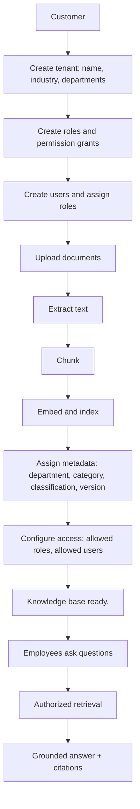

# Customer onboarding

Onboarding a new company is a data operation, not a code change. No model is fine-tuned and no
business logic mentions any specific company.



## In the product

`/onboarding` performs the whole flow in one screen:

1. **Create your organization** — company name and industry (Manufacturing, Healthcare, Financial
   Services, Retail, Information Technology, Education, Logistics, Professional Services).
2. **Upload your knowledge** — PDF, DOCX, TXT or Markdown files.
3. **Select document category** — HR, Finance, Engineering, Operations, Safety, Security, Other.
4. **Configure access** — allowed roles, department, classification.
5. **Build Knowledge Base** → ingestion runs → **"Knowledge base ready."**

The new tenant immediately has its own isolated database rows, vector records, users and roles.

## Via the API

```bash
curl -X POST localhost:4317/api/onboarding/tenants \
  -H 'content-type: application/json' \
  -d '{"name":"Acme Logistics","industry":"Logistics",
       "departments":["Operations","Finance","Safety"],
       "adminName":"Meera Shah","adminEmail":"meera@acme.example"}'
```

Then upload documents as that tenant's admin (`POST /api/knowledge/upload`, multipart:
`file`, `department`, `category`, `classification`, optional `allowedRoles`, `version`).

## What the customer provides vs. what NOVA provides

| Customer provides | NOVA provides |
| --- | --- |
| Documents and knowledge | Ingestion, chunking, embedding, indexing |
| Users, roles, permissions | Identity-aware retrieval and authorization |
| Department and classification conventions | Grounding, citations, confidence |
| Enterprise systems to act on | Agentic workflows behind `ActionProvider` |

The LLM is never fine-tuned on customer documents. Documents are retrieval knowledge, so policies
can change, be re-versioned, or be deleted with immediate effect and no retraining.

## Swapping the demo company

Delete or ignore the NovaTech seed and onboard any other company; departments, roles, classifications
and suggested questions are all read from tenant data. `knowledge/acme/` plus the Acme tenant in the
seed exist to prove this and to back the cross-tenant isolation tests.
