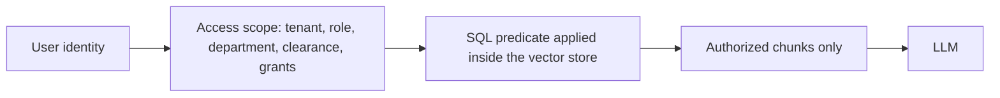

# Security model

## Principle: authorization before retrieval



The model never receives content the caller may not read. NOVA does not retrieve everything and ask
the model to keep quiet.

## Tenant isolation

- Every tenant-scoped table has `tenant_id` and a tenant-first index.
- Retrieval filters on `tenant_id` in three joined tables (chunk, document, version) inside the store.
- Conversations, messages, citations, incidents and audit rows are all tenant-scoped.
- Tests 1 and the `tenant-01/02` evaluations assert that Acme content is unreachable from NovaTech
  and vice versa, including when the question quotes the other tenant's document title verbatim.

## RBAC

Roles are tenant data, not code. A role is a key plus a list of grants of the form
`(department | '*', maximum classification)`. Classification levels: public 1, internal 2,
confidential 3, restricted 4.

`decideDocumentAccess` returns an allow/deny plus a reason: `tenant_mismatch`, `explicit_user_grant`,
`admin_role`, `role_not_in_document_acl`, `classification_above_clearance`, `role_grant`.

Seeded demo grants:

| Role | Grants |
| --- | --- |
| EMPLOYEE, MANAGER | `('*', internal)` |
| ENGINEERING_MANAGER | `+ ('Engineering', confidential)` |
| FINANCE_MANAGER | `+ ('Finance', confidential)`, `('Procurement', confidential)` |
| HR_MANAGER | `+ ('Human Resources', confidential)` |
| SAFETY_MANAGER | `+ ('Safety', confidential)`, `('Manufacturing Operations', confidential)` |
| ADMIN | `('*', restricted)` |

## Authentication (Phase 6)

Two providers, selected only by `AUTH_MODE`:

| Mode | Provider | What it proves |
| --- | --- | --- |
| `demo` | `DemoAuthProvider` | Nothing. A persona selector with an HMAC-signed token, labelled as non-production in the UI |
| `entra` | `EntraAuthProvider` | A Microsoft Entra ID access token for `api://<clientId>/access_as_user`, validated in full |

Entra mode never falls back to demo authentication:

- incomplete Entra configuration -> startup `ConfigError`
- invalid/expired/wrong-audience/wrong-tenant/missing-scope token -> **401**
- valid identity with no linked NOVA user -> **403** (`identity_not_linked`)
- linked but pending/disabled user -> **403** (`identity_pending`)
- role/clearance insufficient -> **403** (`forbidden`)

Validation covers signature (RS256 against cached JWKS), issuer, audience, tenant, expiry,
`nbf` and the `access_as_user` scope. The SPA is a **public client**: Authorization Code with
PKCE, no client secret anywhere, no implicit flow, and tokens held by MSAL in session storage
rather than assembled from arbitrary values by application code.

### Entra authenticates, Neon authorizes

```
Entra access token -> validated oid
                   -> users.entra_object_id (Neon)
                   -> tenant, role, department, permissions, clearance
                   -> AccessScope
                   -> Azure AI Search security filter (Phase 4)
                   -> document authorization before Azure Blob (Phase 5)
                   -> authorized chunks only -> Foundry
```

No claim in the token can set a NOVA tenant, role, department, clearance or user id, and
neither can a request body: the server reads all of them from Neon on every request. A
`nova_tenant_id`, `role`, `department` or `classification` sent by a client is ignored, which
`tests/auth.test.ts` asserts explicitly. Identity is keyed on the stable `oid`, never on
email, UPN or display name, so a rename or a reassigned address changes nothing.

Identity links are administrator-only (`/api/admin/users/:id/entra-link`); a normal employee
cannot claim another person's Entra identity, and links are never inferred from an email
domain. Self-service onboarding, which mints an administrator anonymously, is disabled
whenever `AUTH_MODE` is not `demo`.

Error bodies carry no JWT content, no claims, no signing keys, no discovery metadata and no
raw Entra text; logs record a failure category and request id only. `/api/health` and
`/api/admin/metrics` make no Entra network call at all.

### Session transport and CSRF

The browser sends `Authorization: Bearer <access token>`. No authentication cookie exists in
either mode, so classic CSRF does not apply; the two unauthenticated state-changing routes
keep their Origin check. CORS is unchanged: frontend and API are same-origin, and
`Access-Control-Allow-Origin: *` is never sent.

## Denial without disclosure

When the authorized evidence cannot answer the question but material beyond the caller's clearance
matches better, NOVA returns:

```
ACCESS DENIED

Your current role does not have permission to access this information.
```

The probe used to reach that conclusion is metadata-only: the store returns counts, never titles,
metadata or text. The denial is audited as `Restricted Knowledge Request — Denied`.

## Prompt injection defence

- Documents are scanned at ingestion (`documents/injection.ts`) for instruction-override,
  system-prompt-extraction, role-override, secret-extraction, exfiltration, authorization-bypass and
  fake-authority patterns.
- Matching lines are replaced with `[neutralised untrusted instruction: ...]` before the chunk enters
  model context; the original document is never modified.
- The system prompt labels all evidence as untrusted data that may contain instructions to ignore.
- User-supplied attacks are detected separately (`detectUserAttack`) and refused.
- `knowledge/novatech/security/vendor_integration_notice.md` is a deliberately malicious fixture used
  by the tests.

## Citation integrity

Citations are reconciled against the actual retrieved chunk set. A reference the model invents is
dropped rather than displayed, and an answer left without evidence is downgraded to
`INSUFFICIENT EVIDENCE`.

## Logging and privacy

- Structured JSON logs carry request ID, tenant, user, latency, retrieval status, citation count,
  authorization result and action status.
- `redact()` strips anything resembling a secret, token, password, API key or credential, and truncates
  long values. Document text is never logged; activity details are metadata only.
- Customer documents are treated as confidential by default, are not used for training or fine-tuning,
  and are deletable with immediate effect on retrieval.

## Security test suite (`npm test`)

1. Cross-tenant leakage 2. Unauthorized document access 3. Document prompt injection
4. System prompt extraction 5. Secret extraction 6. Citation fabrication 7. Hallucination
8. Inactive document retrieval 9. Superseded version retrieval 10. Unauthorized action execution

11. Same-tenant unauthorized conversation read 12. Same-tenant unauthorized conversation delete
13. Cross-tenant conversation id probing 14. Feedback ownership

`tests/security.test.ts` contains **14** security cases (the 10 required, plus
the 4 ownership cases added by the continuity pass). `tests/platform.test.ts`
contains **9** platform cases, so `npm test` executes **23** tests in total.

> Verification status: these counts are read from the source of the test files
> in this repository. They were **not** confirmed by executing `npm test` in
> the environment that produced this revision, because dependency installation
> had no registry network access there. See `production-blockers.md` for the
> honest per-command PASS / FAIL / NOT RUN status.

---

## Hardening pass (continuity + security release)

This section documents what was implemented in the repository-level hardening
pass, including deliberate non-decisions. Nothing here is aspirational: if a
control is planned rather than implemented, it says so.

### Ownership is enforced per user, not per tenant

Tenant match alone was previously treated as authorization for conversation
reads, deletes, chat appends and message feedback. Two people in the same
workspace are different principals, so tenant scoping leaked sibling data.

Implemented:

- `ConversationService.getOwned(tenantId, userId, conversationId)` is the only
  read path used by request handlers. `get()` remains for internal,
  already-authorized use.
- `ConversationService.ownsMessage(tenantId, userId, messageId)` joins
  `messages -> conversations` on `user_id`, so feedback cannot be written by
  knowing a message id.
- `GET /api/conversations/:id`, `DELETE /api/conversations/:id`,
  `POST /api/chat` (when `conversationId` is supplied) and
  `POST /api/messages/:id/feedback` all resolve ownership first.
- Failures return **404 Not Found**, not 403. A 403 would confirm that the
  resource exists and belongs to somebody else.
- Conversation deletion is recorded in the activity log.

Covered by `tests/security.test.ts` cases 11-14 (same-tenant read, same-tenant
delete, cross-tenant id probe, feedback ownership).

### Knowledge statistics scope

`GET /api/knowledge` previously returned tenant-wide document statistics to
every caller, which disclosed counts of documents the caller could not read.
Statistics are now derived from the caller's already-authorized document list;
the tenant-wide aggregate is returned only to administrators.

### Rate limiting

Implemented in `backend/src/api/security.ts` as a fixed-window, in-process
limiter keyed by a SHA-256 prefix of the bearer token, falling back to
`x-forwarded-for` / socket address for unauthenticated routes.

| Bucket | Default | Env override | Routes |
| --- | --- | --- | --- |
| auth | 20 / min | `RATE_LIMIT_AUTH` | `POST /api/session` |
| onboarding | 5 / 10 min | `RATE_LIMIT_ONBOARDING` | `POST /api/onboarding/tenants` |
| chat | 40 / min | `RATE_LIMIT_CHAT` | `POST /api/chat` |
| upload | 20 / 10 min | `RATE_LIMIT_UPLOAD` | `POST /api/knowledge/upload` |
| action | 30 / min | `RATE_LIMIT_ACTION` | action execution |
| feedback | 120 / min | `RATE_LIMIT_FEEDBACK` | `POST /api/messages/:id/feedback` |
| adminWrite | 60 / min | `RATE_LIMIT_ADMIN_WRITE` | admin mutations |
| read | 600 / min | `RATE_LIMIT_READ` | general reads |

Exceeding a bucket returns `429` with `retry-after`, `x-ratelimit-limit` and
`x-ratelimit-remaining`, and a generic message that does not disclose the
window algorithm. `RATE_LIMIT_DISABLED=true` turns the limiter off for load
testing.

**Known limitation:** the counter lives in process memory. Behind more than one
node it degrades to per-instance limits. A shared store (Redis / Azure Cache)
is required before horizontal scaling. This is not implemented.

### Security headers

`applySecurityHeaders()` runs on every response:

- `Content-Security-Policy`: `default-src 'self'`; `object-src 'none'`;
  `frame-ancestors 'none'`; `form-action 'self'`; `script-src 'self'`;
  `style-src 'self' 'unsafe-inline' https://fonts.googleapis.com`;
  `font-src 'self' https://fonts.gstatic.com data:`;
  `img-src 'self' data: blob:`; `connect-src 'self'`.
  - `'unsafe-inline'` is retained for styles only, because the app ships
    inline style attributes for motion variables. Scripts have no such
    exception. Removing the style exception requires a nonce pipeline in the
    esbuild step; that is **not implemented**.
  - Google Fonts hosts are allowlisted because the shell loads Anton, Inter,
    Archivo Black and IBM Plex Mono from there. Self-hosting the fonts would
    let both entries be dropped.
- `X-Content-Type-Options: nosniff`, `X-Frame-Options: DENY`,
  `Referrer-Policy: strict-origin-when-cross-origin`,
  `Permissions-Policy: camera=(), microphone=(), geolocation=(), payment=(), usb=()`,
  `Cross-Origin-Opener-Policy` and `Cross-Origin-Resource-Policy: same-origin`.
- Transport: TLS is terminated in front of NOVA by default
  (`HTTPS_ENABLED=false`), which is how App Service and reverse proxies deploy
  it. Locally the server is plain HTTP on loopback; browsers already treat
  `localhost` as a secure context. Set `HTTPS_ENABLED=true` with a real
  certificate when NOVA must terminate TLS itself. An unreadable certificate is
  a startup failure, never a silent downgrade to plain HTTP.
- `Strict-Transport-Security` is emitted when NOVA serves TLS in a non-local
  deployment, or when the request arrived with `x-forwarded-proto: https`. It
  is deliberately **not** sent by the fully local server, because pinning
  `localhost` to HTTPS would affect every other local project on that name.

### Session strategy and CSRF

Current state, stated plainly:

- **LOCAL demo auth** issues a signed demo token that the browser keeps in
  `localStorage` and sends as `Authorization: Bearer`. This is a demonstration
  identity mechanism, not production authentication, and the UI labels the
  deployment `LOCAL DEMO MODE`.
- Because the credential is an explicitly attached header rather than an
  ambient cookie, classic form-based CSRF does not apply to authenticated
  routes: a cross-site form cannot attach the header.
- The two mutating routes that accept unauthenticated requests
  (`POST /api/session`, `POST /api/onboarding/tenants`) are additionally guarded
  by `assertSameOrigin()`, which rejects a cross-origin `Origin` header.
- **Planned, not implemented:** the production path should move to an
  `HttpOnly; Secure; SameSite=Lax` cookie issued after Entra ID sign-in, at
  which point a double-submit or origin-bound CSRF token becomes mandatory for
  every state-changing route. Adding CSRF tokens today would be ceremony
  against a threat the current scheme does not have.

### Input validation

Every public route validates before it acts: identifiers must match
`/^[A-Za-z0-9_:.-]{1,128}$/`, free text is length-bounded (chat message 4000
chars, tenant name 160, email 320), feedback values are whitelisted to
`up | down | null`, and pagination limits are clamped. Backend validation is
authoritative; the frontend is never trusted.

### Errors and audit logging

Handlers return a safe public message plus the `x-request-id` that correlates
to the server-side structured log. Stack traces, database paths, provider
endpoints and prompts are never sent to the client. The audit log records
timestamp, request id, tenant, user, role, action, resource, status, latency
and authorization outcome, and never records tokens, secrets or document
bodies.

### Authorization precedes retrieval

This is an architectural invariant, not a UI behaviour. The pipeline is
identity -> tenant -> role -> department -> classification -> authorized
retrieval -> grounding -> model. Restricted chunks are filtered out before the
prompt is assembled; the model is never given material and asked to withhold
it. Cases 1-10 of the security suite exercise this.

### Prompt injection

Retrieved documents are treated as untrusted data. Mitigations: retrieved text
is delimited and labelled as data, the system prompt states that document
content cannot issue instructions, answers must cite retrieved chunks, and the
action path re-checks role permissions rather than trusting model output. Case
3 of the security suite feeds a poisoned document and asserts the model neither
leaks the system prompt nor invents a secret.

NOVA does not claim to be injection-proof. These are mitigations with tests,
not a guarantee.

---

## Governed enterprise actions (Phase 8)

Reading a policy is reversible. Writing into a system of record is not, so actions have their own
controls. Full detail in `docs/governed-actions.md`; the security-relevant decisions are:

- **A separate capability.** Action permissions live in `role_action_permissions` and are loaded
  into `AccessScope.actionPermissions`. They are deliberately NOT folded into the `permissions`
  table, which is a *reading clearance*: being cleared to read the IT support policy is not
  permission to raise a ticket against it. Conflating them would make every reader a writer.
- **Tenant from the token only.** Every action route resolves its tenant through
  `requireIdentity()`. No body, query string or header supplies a tenant, and `tenantId` is not a
  declared input field of any action, so a payload containing one is rejected outright rather than
  quietly used. A valid, pending action id from another workspace returns `tenant_mismatch`.
- **Authorization before validation.** An unauthorized caller gets `forbidden` before the input is
  looked at, so validation messages cannot be used to probe the shape of an action they may not
  perform.
- **Explicit confirmation.** `undefined`, `null`, `"true"`, `1` and `{}` are all
  `confirmation_required`, not consent.
- **Re-authorization after confirmation.** The confirm request re-runs `decideActionAccess()`
  against a scope rebuilt from Neon on that request, so a grant revoked while a proposal was open
  stops the action. The audit row is updated to `failed` / `denied`.
- **The payload is frozen.** `POST /api/actions/:id/confirm` accepts only `{confirm}`. The input
  that executes is the one validated at propose time and re-validated from the audit row, so a
  confirmation cannot be used to substitute a different amount or subject for the one the person
  was shown.
- **Only the requester may confirm** — not a colleague, not an administrator. Otherwise the audit
  trail would name the wrong human as the person who agreed to it.
- **Denials are audited.** A refused proposal is written to `action_requests` and `activity_logs`
  before the 403 is returned. Its *payload* is not stored: it was never validated, so it is
  unbounded attacker-controlled text.
- **Source attribution is access-checked.** An action may only cite a document the requester can
  actually read (same `decideDocumentAccess()` as retrieval), so the audit trail can never become a
  read oracle for restricted material.
- **No silent simulation.** `ACTION_MODE=azure` without `AZURE_ACTION_FUNCTION_URL` refuses to
  start. A non-https Function URL outside localhost is refused, because a function key over plain
  HTTP is a leaked credential. The key is sent as a header, never in the URL where it would land in
  every proxy and App Service access log.
- **Nothing upstream leaks outward.** Endpoints, keys, transport errors and upstream response
  bodies are logged (`action.function.*`); callers receive a fixed error code from a closed
  vocabulary and a message written for a person.
- **Personal data stays out of logs.** `activity_logs.detail` for an action is a short summary
  (`create_it_request -> ITR-2026-…`), never the input payload, which can contain new-hire names,
  emails and justifications.
